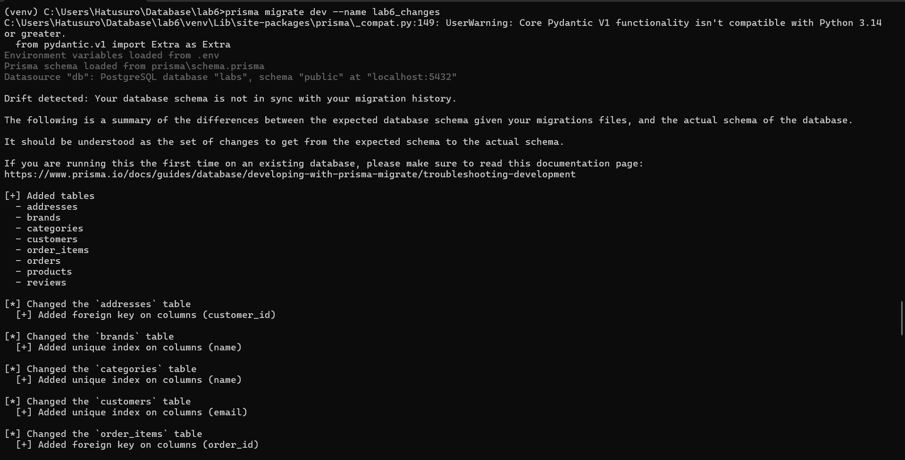
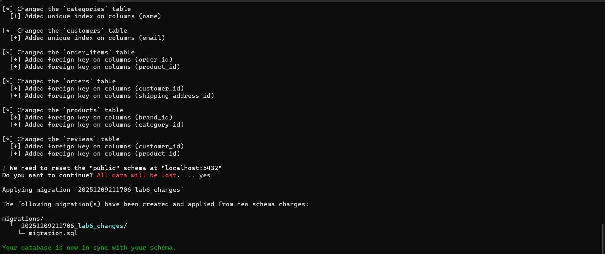
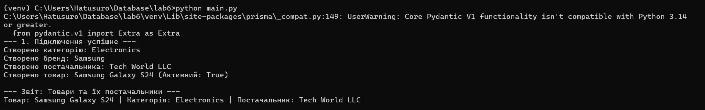

# Звіт з виконання Лабораторної роботи №6
**Тема:** Міграції бази даних та робота з Prisma ORM (Python)

---

## 1. Підготовка та аналіз (Introspection)
Було ініціалізовано проект Prisma, налаштовано підключення до існуючої бази даних PostgreSQL (`labs`).
Використано команду `npx prisma db pull` для зчитування існуючої структури таблиць (з Лабораторної №5) та генерації початкової схеми у файлі `schema.prisma`.

---

## 2. Зміни в схемі та Міграція
У файл `schema.prisma` було внесено такі зміни для імітації розвитку проекту:

1.  **Додано нову модель:** `Supplier` (Постачальники) з полями `id` та `name`.
2.  **Змінено модель `products`:**
    * Додано поле `is_active` (тип `Boolean`, значення за замовчуванням `true`).
    * Додано зв'язок з моделлю `Supplier` (поле `supplier_id`).
    * **Видалено** поле `description` (оптимізація структури).

Застосовано міграцію командою:
`prisma migrate dev --name lab6_changes`

При цьому було виконано перестворення таблиць (Reset) для застосування нових зв'язків.

**Скріншот 1: Успішне застосування міграції в терміналі**

---

## 3. Перевірка роботи (Prisma Client Python)
Було написано скрипт `main.py`, який використовує клієнт Prisma для:
1.  Створення тестових даних (Категорія, Бренд, Постачальник).
2.  Створення товару з прив'язкою до постачальника.
3.  Виконання запиту `find_many` з `include` (аналог JOIN) для отримання товарів разом з іменами їх постачальників.

**Результат:** Скрипт успішно підключився до бази, записав дані та вивів їх у консоль. Це підтверджує коректність нової схеми.

**Скріншот 2: Результат виконання скрипта main.py**

---